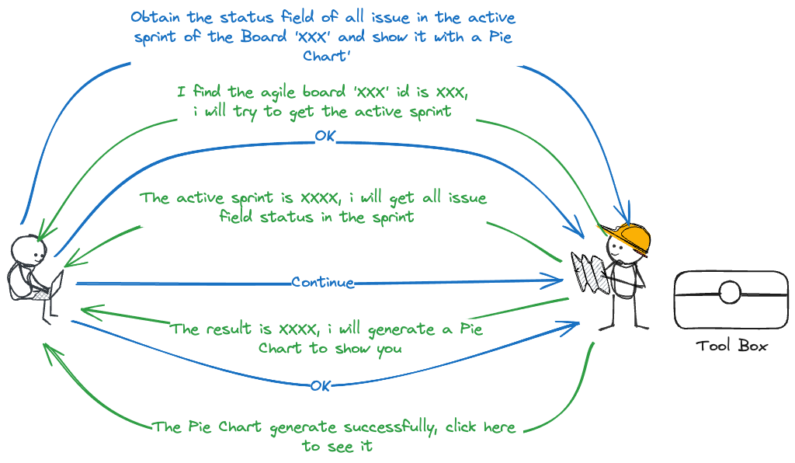

# AutoGen Jira
This is an AI assistant dedicated to improving user interaction with Jira.

It allows users to organize complex Jira operations through natural language, such as:
`Obtain the status field of all issue in the active sprint of the Board 'XXX' and show it with a Pie Chart'`

The AI Assistant will break down this task into sub-tasks, and use tools to solve them, such as:

## Feature
1. A single chat page to interact with the AI assistant
2. A log page to show the history of the chat
3. A measurement page to show the cost and tools used
4. Easy to add yourself tools to the AI assistant
